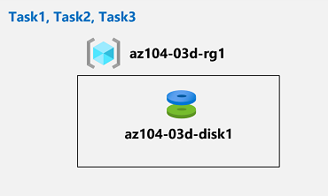

# Lab 3d - Manage Azure resources by Using Azure CLI
## Lab scenario
Now that you explored the basic Azure administration capabilities associated with provisioning resources and organizing them based on resource groups by using the Azure portal, Azure Resource Manager templates, and Azure PowerShell, you need to carry out the equivalent task by using Azure CLI. To avoid installing Azure CLI, you will leverage Bash environment available in Azure Cloud Shell.

## Objectives
In this lab, you will:
+ Task 1: Start a Bash session in Azure Cloud Shell
+ Task 2: Use the existing resource group and create an Azure managed disk by using Azure CLI
+ Task 3: Configure the managed disk by using Azure CLI

## Architecture diagram


## Excercise: Manage Azure resources by Using Azure CLI

## Task 1: Start a Bash session in Azure Cloud Shell

In this task, you will open a Bash session in Cloud Shell. 

1. From the portal, open the **Azure Cloud Shell** by clicking on the icon in the top right of the Azure Portal.

1. If prompted to select either **Bash** or **PowerShell**, select **Bash**. 

    **Note**: If this is the first time you are starting **Cloud Shell** and you are presented with the **You have no storage mounted** message, select the subscription you are using in this lab, and click **Show Advanced Settings**.

    

    >Under **Advanced Settings**, you need to select an existing resource group from the **Resource group** dropdown and give some unique name under the **Storage Account** section, and under the **File share** section type none as shown in the below image.

    
    

1. Click **Create storage**, and wait until the Azure Cloud Shell pane is displayed. 

1. Ensure **Bash** appears in the drop-down menu in the upper-left corner of the Cloud Shell pane.

## Task 2: Use the existing resource group and create an Azure managed disk by using Azure CLI
In this task, you will use the existing resource group for creating the Azure managed disk by using the Azure CLI session within Cloud Shell.

1. From the Bash session within Cloud Shell, run the following commands with the value of the DeploymentID, you can find Deployment ID from the environmental detail page:

   ```sh
   LOCATION=$(az group show --name 'az104-03c-rg1-DeploymentID' --query location --out tsv)

   RGNAME='az104-03d-rg1-DeploymentID'
   ```
1. To retrieve properties of the created resource group, run the following:

   ```sh
   az group show --name $RGNAME
   ```
1. To create a new managed disk with the same characteristics as those you created in the previous labs of this module, from the Bash session within Cloud Shell, run the following:

   ```sh
   DISKNAME='az104-03d-disk1'

   az disk create \
   --resource-group $RGNAME \
   --name $DISKNAME \
   --sku 'Standard_LRS' \
   --size-gb 32
   ```
    >**Note**: When using multi-line syntax, ensure that each line ends with back-slash (`\`) with no trailing spaces and that there are no leading spaces at the beginning of each line.

1. To retrieve properties of the newly created disk, run the following:

   ```sh
   az disk show --resource-group $RGNAME --name $DISKNAME
   ```

## Task 3: Configure the managed disk by using Azure CLI
In this task, you will be the managing configuration of the Azure managed disk by using the Azure CLI session within Cloud Shell. 

1. To increase the size of the Azure managed disk to **64 GB**, from the Bash session within Cloud Shell, run the following:

   ```sh
   az disk update --resource-group $RGNAME --name $DISKNAME --size-gb 64
   ```

1. To verify that the change took effect, run the following:

   ```sh
   az disk show --resource-group $RGNAME --name $DISKNAME --query diskSizeGb
   ```

1. To change the disk performance SKU to **Premium_LRS**, from the Bash session within Cloud Shell, run the following:

   ```sh
   az disk update --resource-group $RGNAME --name $DISKNAME --sku 'Premium_LRS'
   ```

1. To verify that the change took effect, run the following:

   ```sh
   az disk show --resource-group $RGNAME --name $DISKNAME --query sku
   ```

   > **Congratulations** on completing the task! Now, it's time to validate it. Here are the steps:
   > - Navigate to the Lab Validation Page, from the upper right corner in the lab guide section.
   > - Hit the Validate button for the corresponding task. If you receive a success message, you can proceed to the next task. 
   > - If not, carefully read the error message and retry the step, following the instructions in the lab guide.
   > - If you need any assistance, please contact us at labs-support@spektrasystems.com. We are available 24/7 to help you out.

### Review

In this lab, you have:

- Started a Bash session in Azure Cloud Shell
- Use the existing resource group and create an Azure managed disk by using Azure CLI
- Configured the managed disk by using Azure CLI
